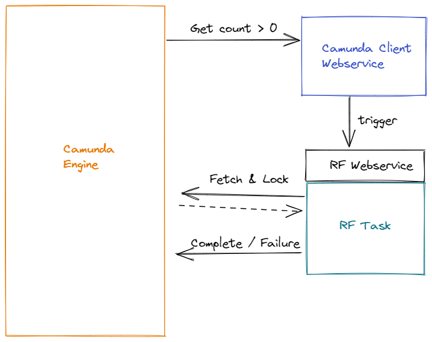
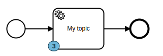
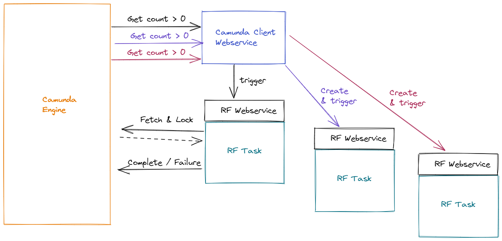

# Catow: Camunda Topic Watcher
Catow is a small webservice based on [fastapi](https://fastapi.tiangolo.com/). 
It checks, if a topic in Camunda BPMN platform as more than 0 tokens. 
If so, an HTTP-GET is triggered. In combination with 
[robotframework webservice](https://github.com/postadress/robotframework-webservice), this can trigger a robot task. 
When the robot tasks uses [CamundaLibrary](https://github.com/MarketSquare/robotframework-camunda), 
it can consume the token provided by Camunda.

## Installation

Camunda Topic Watcher is not yet available on pypi. But you can install it directly from github:

```
pip install git+https://github.com/Noordsestern/catow.git
```

## Usage

```
python -m Catow.main -t <topic to be subsribed to> -r <url to be triggered>
```

You can also add:
- `-p` specifying the port Camunda Topic Watcher should run on (used later for heath checks) (default: 5003)
- `-i` definying the polling interval in seconds (default: 3 seconds)
- `-c` setting the url to Camunda (default: `http://localhost:8080)`

## Concept
Catow is under development and currently in Alpha.

Catow helps you when running robotframework tasks with CamundaLibrary tomake sure that the task
has actually tokens to fetch from Camunda:


## Run demo
### Pre assumption
#### Python installed
Make sure you have python installed. Recommended is 3.9.

#### Camunda installed
You already have Camunda platform running on `http://localhost:8080`. You can find installation instractions at 
[Camunda Documentation](https://docs.camunda.org/manual/latest/introduction/downloading-camunda/#download-the-runtime).

### 1. Install Robot Framework and CamundaLibrary
Run
```shell
pip install robotframework-camunda
```
`robotframework-camunda` will automatically pull the apropriate version of Robot Framework.

### 2. Upload demo model
While having Camunda platform running, upload the model by running:
```shell
robot -d logs tests/demo_upload_model.robot
```

### 3. Start demo process
Produce a few demo process instances by running:
```shell
robot -d logs tests/demo_producer.robot
```
You can verify in Camunda cockpit that you now have demo tokens waiting in the process:


### 3. Start Robotframework webservice
First install robotframework-webservice with pip
```shell
pip install robotframework-webservice
```
create a `logs` folder:
```shell
mkdir logs
```
and start the webservice while providing the demo consumer:
```shell
 python -m RobotFrameworkService.main -p 5004 -t tests/demo_consumer.robot
```
The last call starts the webservice listening on port *5004* and having *tests/demo_consumer.robot* ready to be 
executed.

### 4. Start Catow
Install Catow dependencies with:
```shell
pip install -r requirements.txt
```
Start catow with
```shell
python -m Catow.main
```

### 5. Review the output from Catow
Catow should produce the following output:
```log
INFO:     Started server process [15228]
INFO:     Waiting for application startup.
INFO:     Application startup complete.
{"count":3}
Start Robot!
INFO:     Uvicorn running on http://0.0.0.0:5003 (Press CTRL+C to quit)
{"count":2}
Start Robot!
{"count":1}
Start Robot!
{"count":0}
Nothing to do here.
```
You can see that the `count` goes down for each time Catow triggers the robotframework webservice.
Once the count is at 0, it prints `Nothing to do here.` every time the count is polled.

You can now re-run the `demo_producer.robot` task in order to repeat the experiment.

# Vision
Catow is a very simple service that shall make Robot tasks scalable:

